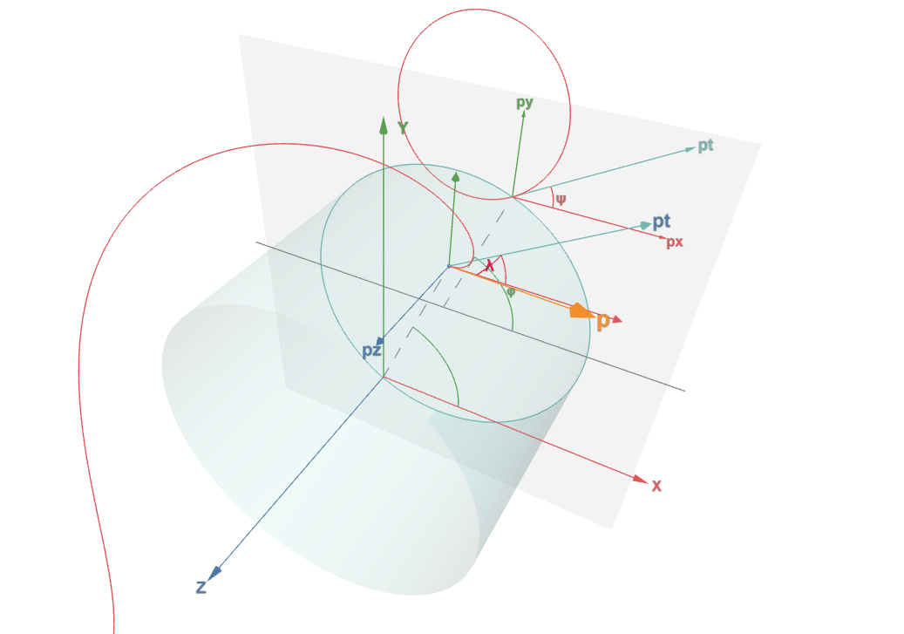

 

---
title: "COMET CDC Track Parameter"
layout: default
permalink: /
---

# COMET CDC Track Parameter

## Introduction
This document describes the definitions of track parameter used for CDC (Cylindrical Drift Chamber) track reconstruction in COMET experiments.

## 1. Coordinate System
The coordinate system is righthanded. We have two coordinate systems, one is the global coordinate system, with the origin on the proton target; the other is CyDet local coordinate system, with the origin at the center of CDC. The center of CDC’s coordinates in the global coordinate system are (6739.95, 0, 7650) mm. The beam direction is the +z direction, and the +y points vertically upward. The azimuthal angle $\phi$ is defined as zero on the x axis and increases towards the y axis. The domain of $\phi$ is [0, 2π].

## 2. Track parameters
The track parameters for CDC track reconstruction is defined as the parameters at the first intersection point between the track and the inner wall of CDC. Therefore, it is located on a circle with a radius of r in the x-y plane, where r is the inner wall radius of CDC. It's a constant. So we can use the following five parameters to describe the position and momentum information of the track:

- **$z_0$**  $z_0$ is the z-coordinate of the intersection point in the local coordinate system

- **$\phi$** $\phi$ is the azimuthal angle of the intersection point in the local coordinate system

- **$\kappa$** $\kappa$ is $\frac{q}{p_t}$ $q$ is the charge and $p_t$ is the transverse momentum of the track at the intersection point

- **$\psi$** $\psi$ is the angle between the transverse momentum and the intersection point position vector. Starting from transverse momentum, clockwise is positive and counterclockwise is negative. The domain is [-π, π].

- **$tan\lambda$** $tan\lambda = \frac{p_z}{p_t}$

From this, we can obtain the coordinates and momentum at the intersection point:

$$x = r \times cos\phi$$

$$y = r \times sin\phi$$

$$z = z_0$$

$$p_x = p_t \times cos(\phi - \psi)$$

$$p_y = p_t \times sin(\phi - \psi)$$

$$p_z = p_t \times tan\lambda$$

> 3D illustration link: [3D illustration](./other-pages/cdc_track_parameter.html)

